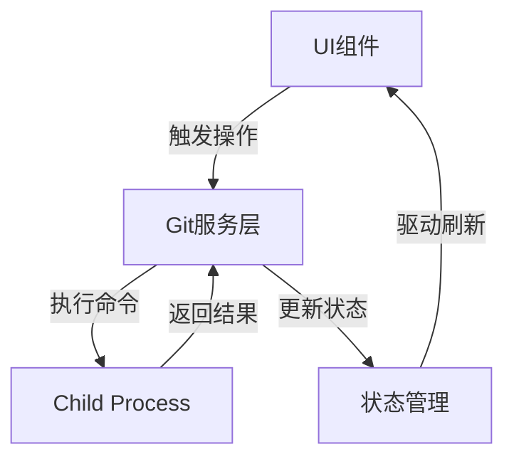

## 产品概述

开发一个Git推送冲突解决助手，帮助用户处理`git push`时遇到的non-fast-forward错误。该工具将自动执行`git pull`合并远程更改，并在成功后重新推送，提供完整的冲突检测、状态反馈和操作指导。

## 核心功能

- 检测并识别non-fast-forward推送错误
- 执行`git pull`获取并合并远程更改
- 自动检测合并冲突并提供详细冲突信息
- 提供冲突解决步骤指导和可视化反馈
- 合并成功后自动重新推送更改
- 实时展示Git命令执行进度和操作结果

## 技术栈选择

基于现有项目技术栈，使用Node.js + TypeScript实现Git命令执行层，集成到现有架构中。

## 技术架构

### 系统架构

- **架构模式**：在现有架构中新增Git操作模块，保持与现有代码风格一致
- **组件结构**：Git服务层 → 状态管理层 → UI展示层
- **数据流向**：



### 模块划分

- **Git命令模块**：封装`git pull`, `git push`, `git status`等命令执行
- 关键技术：Node.js child_process, exec/spawn
- 依赖：无
- 接口：`executeGitCommand(command: string): Promise<GitResult>`

- **冲突检测模块**：解析Git输出，识别冲突类型和受影响文件
- 关键技术：正则表达式匹配，字符串解析算法
- 依赖：Git命令模块
- 接口：`detectConflicts(output: string): ConflictInfo[]`

- **状态管理模块**：管理Git操作状态和进度，提供响应式更新
- 关键技术：React Hooks/Context或现有状态管理方案
- 依赖：Git命令模块
- 接口：`useGitOperation(): GitOperationState`

### 数据流

用户触发冲突解决 → Git服务层执行pull命令 → 解析返回结果 → 更新操作状态 → UI展示进度/结果 → 无冲突则自动执行push

## 实现细节

### 核心目录结构

使用[subagent:code-explorer]探索现有项目结构后，在适当位置添加新文件：

```
project-root/
├── src/
│   ├── services/
│   │   └── git-service.ts           # Git命令执行服务
│   ├── utils/
│   │   └── git-parser.ts            # Git输出解析工具
│   └── components/
│       └── git-conflict-resolver/   # 冲突解决UI组件
│           ├── index.tsx
│           └── conflict-viewer.tsx  # 冲突详情展示
```

### 关键代码结构

**GitResult接口**：定义Git命令执行结果数据结构

```typescript
interface GitResult {
  success: boolean;
  output: string;
  error?: string;
  conflicts?: ConflictInfo[];
}

interface ConflictInfo {
  file: string;
  type: 'merge' | 'rebase';
  details?: string;
}
```

**GitService类**：封装Git操作逻辑，提供统一的命令执行接口

```typescript
class GitService {
  async pull(remote?: string, branch?: string): Promise<GitResult> { }
  async push(remote?: string, branch?: string): Promise<GitResult> { }
  async status(): Promise<GitResult> { }
  private parseGitOutput(output: string): GitResult { }
}
```

## 设计风格

采用现代专业的技术工具风格，使用深色主题配合清晰的视觉层次。界面以功能性为主，突出操作状态和冲突信息展示，营造专业开发者工具的氛围。

## 组件设计

### 冲突解决面板组件

- **顶部状态指示区**：显示冲突类型、仓库路径、当前分支和冲突状态图标
- **中部日志输出区**：实时显示Git命令执行过程，使用等宽字体展示命令输出，支持滚动查看完整日志
- **底部操作按钮区**：提供"拉取并合并"、"查看冲突详情"、"强制推送"、"取消"等操作按钮，按钮状态根据操作进度动态更新

### 冲突详情对话框

- **文件列表区**：展示所有冲突文件列表，每个文件显示路径、冲突类型标记和解决状态
- **解决指引区**：提供分步骤的冲突解决说明，包括如何使用合并工具、如何编辑冲突文件等
- **操作选项区**：提供"打开合并工具"、"标记为已解决"、"放弃合并"等操作按钮

## Agent Extensions

### SubAgent

- **code-explorer**
- 目的：探索现有项目结构，定位Git相关功能代码，分析现有组件和服务的组织方式，确定新功能的集成点和依赖关系
- 预期结果：生成项目结构分析报告，明确新功能的最佳插入位置、需要修改的现有文件以及集成方案